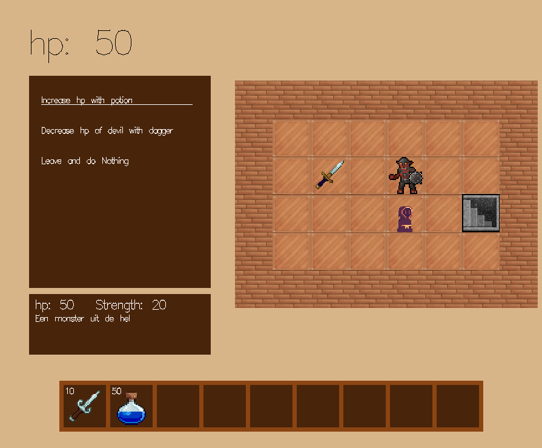
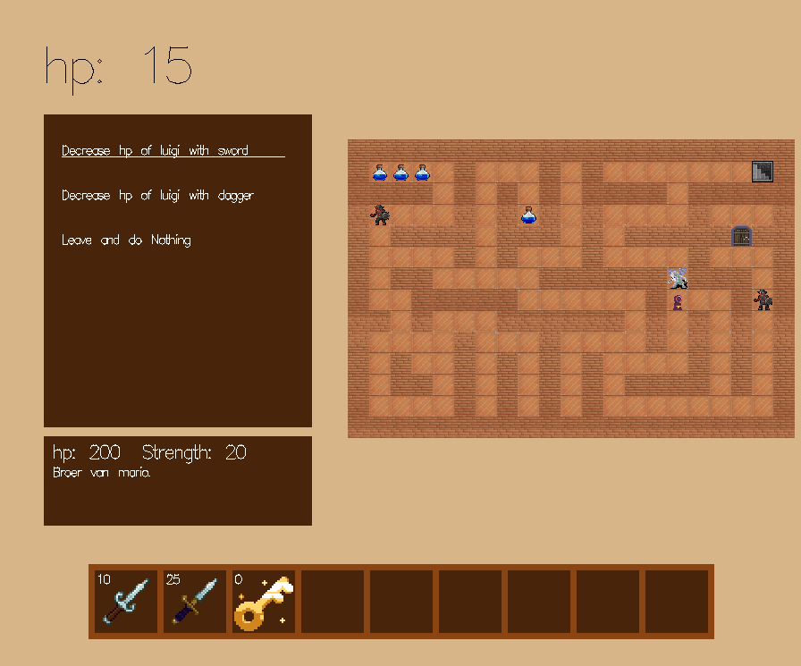

# Haskell RPG Tile Engine

Welcome to this small yet capable RPG tile engine crafted with Haskell. This project provides a simple foundation to build tile-based RPG adventures using JSON-like configuration files stored in a `levels` folder.

## Features

- **Simple Level Design**: Quickly sketch and design levels by defining elements such as items, enemies, doors, and more in easy-to-use JSON-like files.
- **Customizable Assets**: Adjust the appearance, damage potential, and other attributes of various game assets as per your requirements.
- **Tile-Based Exploration**: Embark on a journey where you navigate through levels tile by tile, seeking exits, and encountering various entities along the way.

